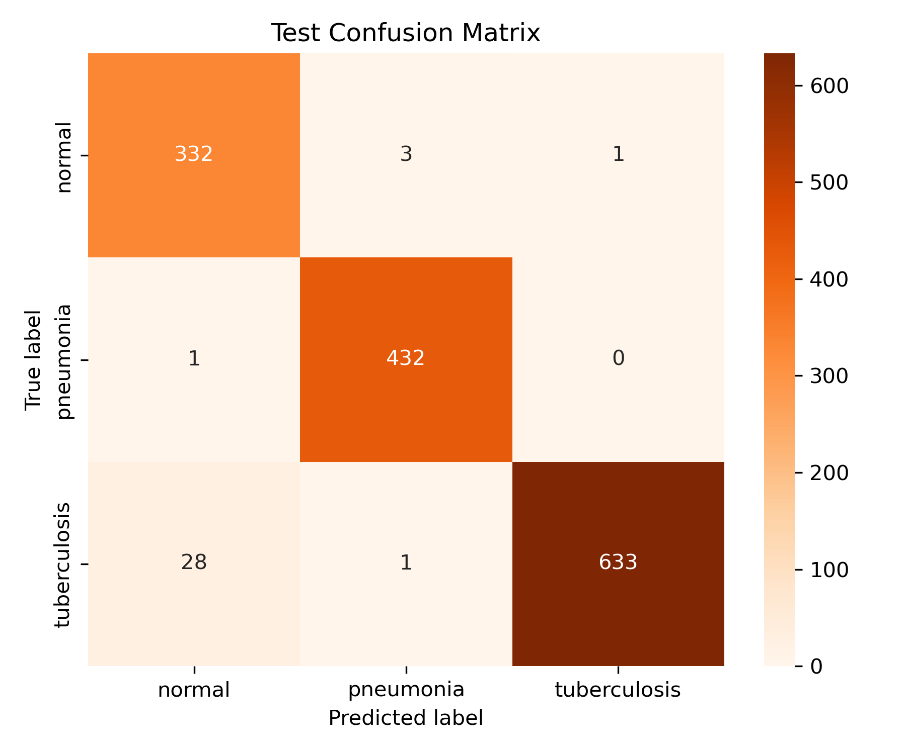
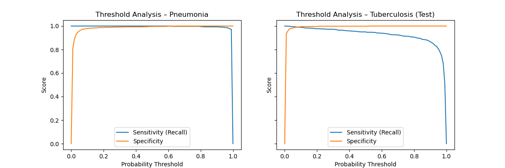
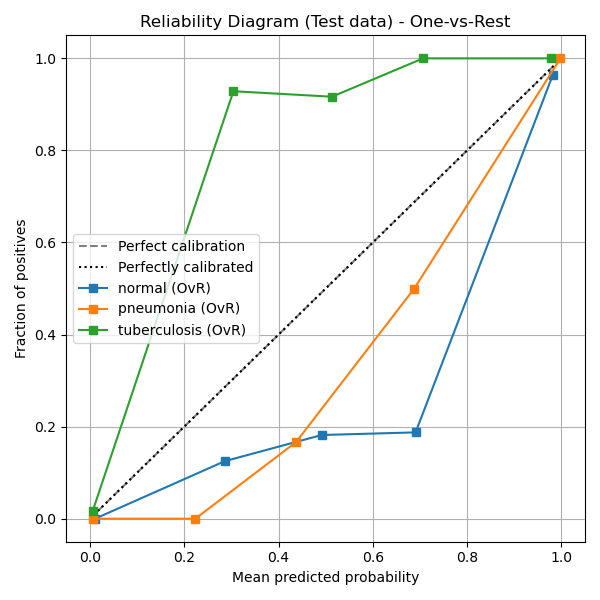
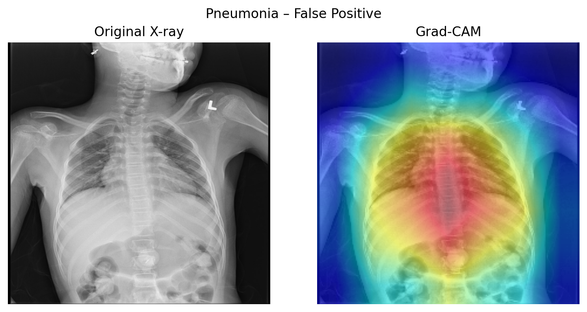
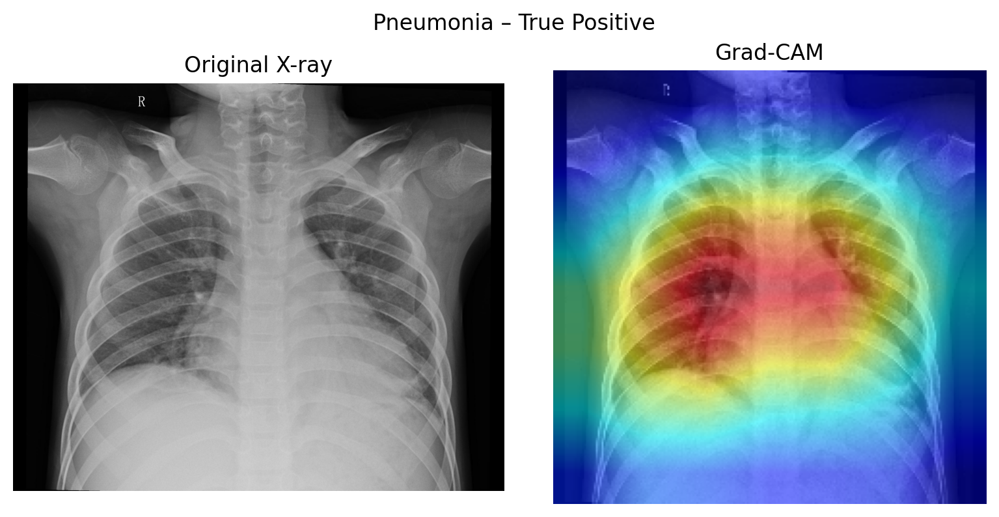
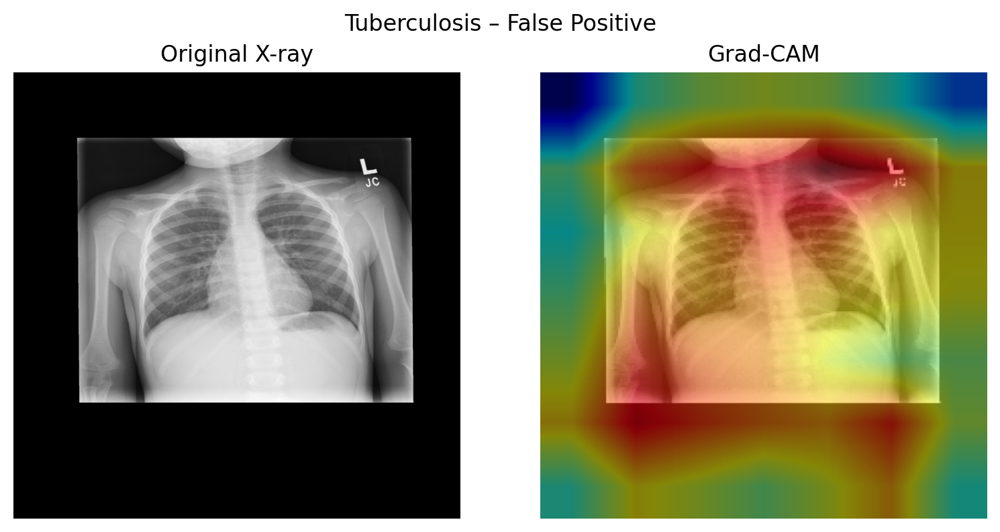
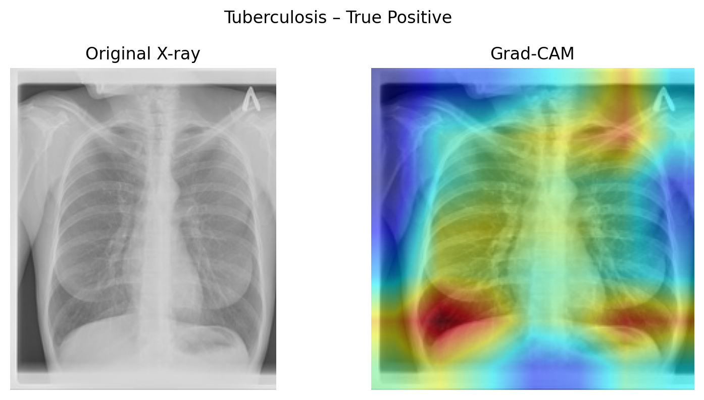
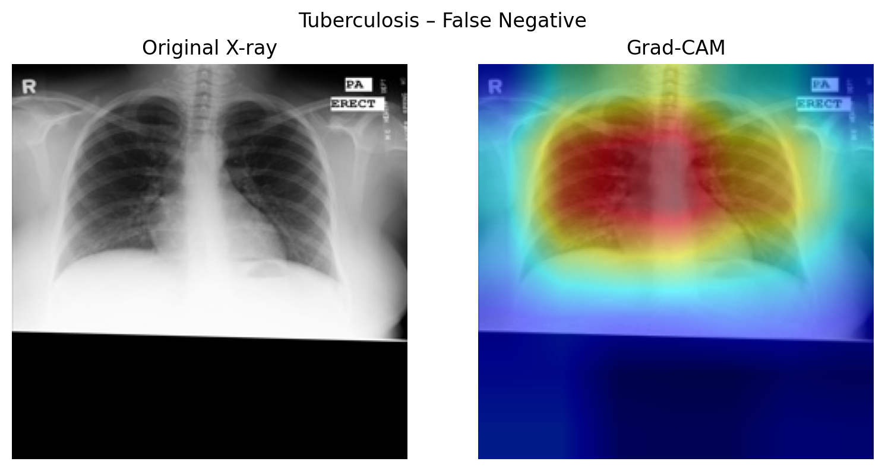
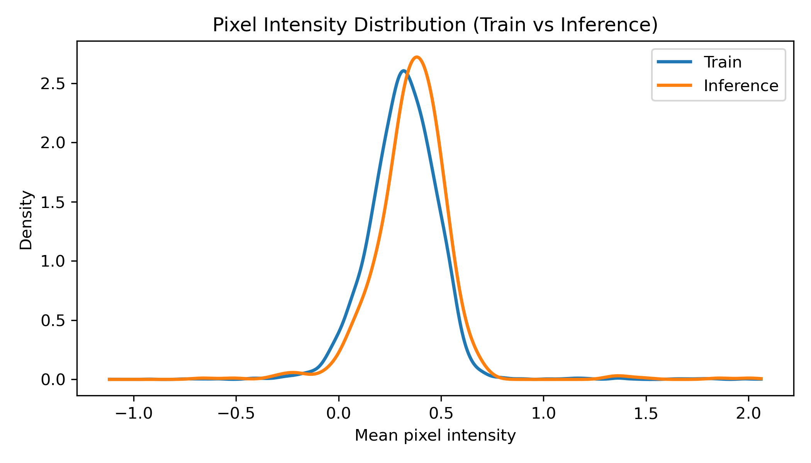

# Deep Learning for Multi-Class Chest X-Ray Classification (Tuberculosis, Pneumonia, Normal)

<a target="_blank" href="https://cookiecutter-data-science.drivendata.org/">
    
</a>

## Description

This repository contains an end-to-end chest X-ray classification pipeline (Normal / Pneumonia / Tuberculosis), including training, evaluation, explainability, inference, deployment, and monitoring utilities.

## Online endpoint for single-image classification

[Online classification URL - Click here](https://huggingface.co/spaces/RamyGadalla/chestxray-SKAI)

## Dateset

Dataset URL: https://www.kaggle.com/datasets/muhammadrehan00/chest-xray-dataset

This dataset merges multiple public chest X-ray sources into one classification set with three classes:

1-Normal  
2-Pneumonia  
3-Tuberculosis    `	

## Quick Start

```
git clone https://github.com/<your-username>/chestxray.git
cd chestxray
``` 
If Kaggle API token is configured on your system, the dataset can be downloaded using:
```
python download_data.py  # download dataset in data/raw/unzipped_raw_data
```
Run inference in Docker container from repo root directory
```
docker build -t chestxray:latest

sudo docker run --rm \
	  -v "$(pwd):/app/chestxray" \
	  -w /app/chestxray \
	  chestxray:latest \
	  make predict \
	  INPUT="" \      # Input images path (single file path or a directory)
	  OUTPUT=""       # output destination path (0ptional). Default is the working directory.
```
`make train` and `make eval` can also be used within the container.

## Project Organization

```
├── chestxray_module                    
│   ├── dataset.py
│   ├── download_data.py
│   ├── extract_reference_stats.py
│   ├── lung_segment_model.py
│   └── modeling
│       ├── evaluate.py  
│       ├── export_onnx.py  
│       ├── monitor.py  
│       ├── predict.py  
│       ├── train.py  
│       ├── dataset.py  
│       └── extract_reference_stat.py                       
├── data
├── Dockerfile
├── environment.yml
├── Makefile
├── models                              
│   ├── best_model.onnx
│   ├── best_model.onnx.data
│   └── best_model.pt
├── notebooks                            
│   ├── 01_ExploratoryDataAnaylsis.ipynb
│   ├── dev_Preprocess.ipynb
│   ├── dev_evaluate.ipynb
│   ├── dev_monitoring.ipynb
│   ├── dev_predict.ipynb
│   ├── dev_segmentation_dev.ipynb
│   ├── dev_training.ipynb
├── pyproject.toml
├── README.md
├── references
│   ├── feature_centroid.npy
│   ├── feature_cov.npy
│   ├── pixel_histograms.npz
│   └── pixel_stats.npz
├── reports
│   ├── best_model
│   ├── inference
│   └── model_with_duplicates_images
├── download_data.py
└── requirements.txt
```
## Running inference, training, and evaluation locally

```s
conda env create -f environment.yml
conda activate medical_imaging_prod
make train
make eval
make predict INPUT="" OUTPUT=""
```
`make predict` supports following options:  
`OUTPUT=`    : destination path for output artifacts  
`BACKEND=`   : choices are either "torch" or "onnx". Default value is "torch"  
`BATCH_SIZE`:  default value 32 for torch and 1 for onnx format (RECOMMENDED)   
`CHECKPOINT`:  default is best_model.pt for "torch" and best_model.onnx for "onnx"  

## Data Preprocessing
Applied to all data splits (train/val/test):  
Resize to 224x224  
Symmetrical padding 
Scale intensity    
Contrast enhancement G-CLAHE
Normalize intensity with ImageNet stats  

Applied to train data split only:  
MONAI augmentaion:  
Rotation  ±10 degrees  
translation: translate_range=(10, 10),scale_range=(0.1, 0.1)  
flippping: spatial_axis=1  
adding Gaussian noise: mean=0.0, std=0.01, prob=0.3  


## Model Training Specification
Key features:
- Pretrained DenseNet-121
- Initialization: ImageNet pretrained weights
- Classifier head:  full connected layers - dropout (`p=0.5`)
- Weighted CrossEntropyLoss (Normal=0,5, Pneumonia=2, Tuberculosis=1.0)
- AdamW (wegith decay L2) differential learning rates
- Primary metric AUROC
- ReduceLROnPlateau scheduler (factor=0,1 and patience=2)
- Early stopping on validation Macro AUROC (patience=5)
- Checkpointing best model (higest maro-AUROC)
- Other metrics: macro-F1 and per-class recall


Classification table
|              |   precision |     recall |   f1-score |   support |
|:-------------|------------:|-----------:|-----------:|----------:|
| normal       |    0.917127 |   0.991045 |   0.952654 |       335 |
| pneumonia    |    0.987981 |   1        |   0.993954 |       411 |
| tuberculosis |    0.998413 |   0.950151 |   0.973684 |       662 |
| accuracy     |             |            |   0.974432 |      1408 |
| macro avg    |    0.96784  |   0.980399 |   0.973431 |      1408 |
| weighted avg |    0.976028 |   0.974432 |   0.974597 |      1408 |


## Evaluation

Evaluation on "Test" dataset

##### Confusion matrix

<p align="center">
  
</p>

##### Threshold Analysis
<p align="center">
 
</p>

##### uncalibrated reliability curve
<p align="center">
 
</p>

##### GradCam Maps
<p align="center">
 
  
</p>

<p align="center">
 
  
</p>


<p align="center">
 
</p>

## Inference  

##### Data Drift Metrics
|   ks_mean_statistic |   ks_mean_pvalue |   ks_std_statistic |   ks_std_pvalue |   cosine_distance_feature_drift |
|--------------------:|-----------------:|-------------------:|----------------:|--------------------------------:|
|            0.151714 |      4.80011e-13 |          0.0667039 |      0.00725856 |                        0.113913 |

  
<p align="center">
 
</p>


--------

