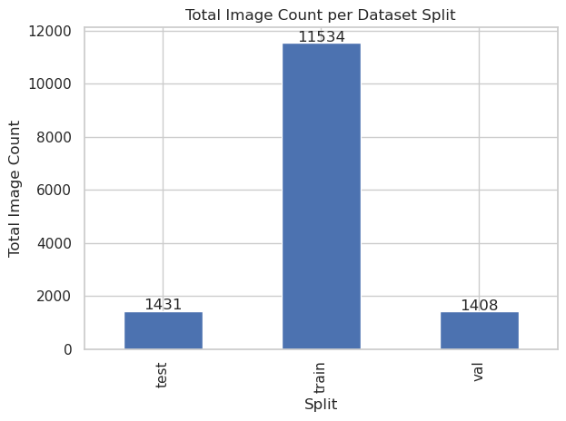
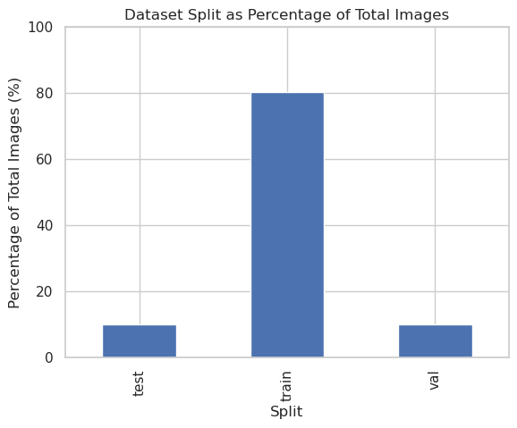
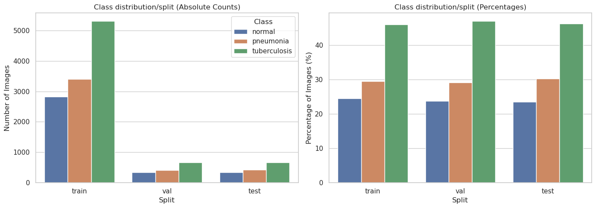
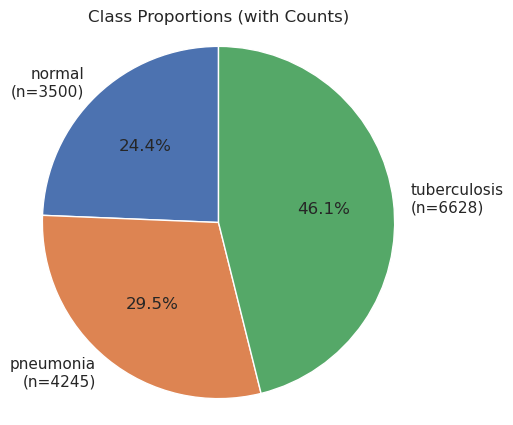
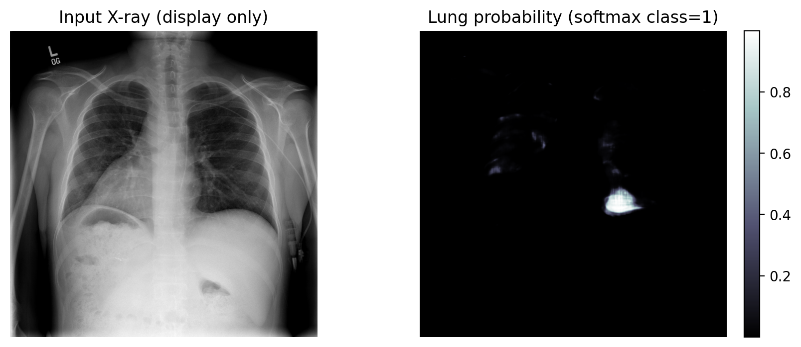
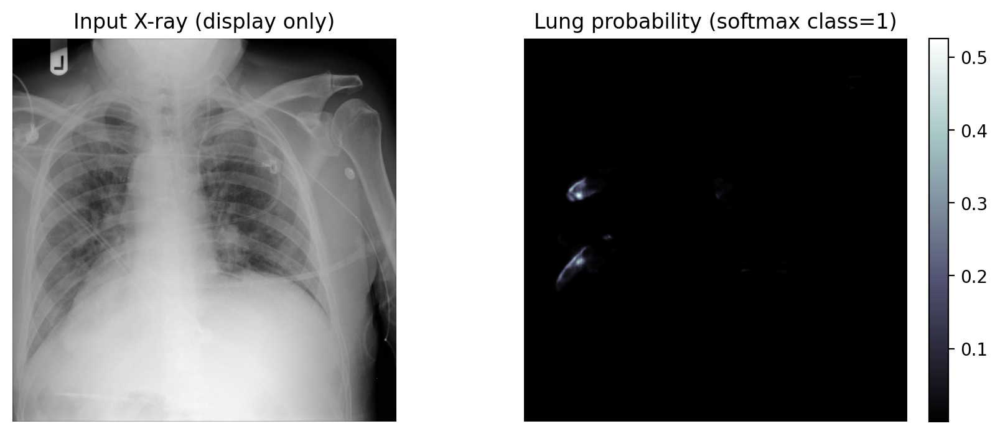

# Report - Ramy Gadalla

## Exploratory Data Analysis

### Duplicates:
Using the md5 hash function, around 5500 pairs of duplicate images were found in this dataset. This was confirmed by visual inspection of sample duplicates. Unfortunately, any logic to delete one of the duplicates arbitrarily will not be supported by any evidence. Two of the same image with two different classes, one of them must be wrong! Keeping the image with the wrong label will have a high cost on the training.   
Please check [data/interim/file_duplicates.csv](data/interim/file_duplicates.csv)

### Image quality:  
A myriad of image quality metric were calculated to exclude images based on blockiness or bluriness, forground-to-background ratio, duplicated view, and image size.   
Please check this directory for all the quality metrics [data/interim](data/interim)

These calculated metrics were used to flag the highest and lowest photos to visual inspction. Very few images were excluded based on image quality metrics. They were completely unusable. The majority of images flagges were still usable despite nad quality metrics, so they wer kept for better generalization of the model to real life data.

For reproducibility, the path of the images that was (subjectively) decided to be excluded are kept in [data/raw/paths_to_delete.csv](data/raw/paths_to_delete.csv)

### Class/split distribution:  
Class distribution inspection after excluding duplicates and low quality images.  

 

Given the figures above, I will keep the current split. The reasons for this are:
a- the split contains all classes,
b- close proportions of each class across splits,
c- keep comparability with existing work,
d- lack of patient metadata to actually make informative re-splitting.

Having that said, there is clear class imbalance on the dataset-level (not the split-level).

## Class imbalance

Class distribution analysis shows mild imbalance across classes, with Tuberculosis representing the largest class (~46%) and Normal and Pneumona are close to each others. All classes are well represented with thousands for image in each, suggesting that aggressive resampling is unnecessary; however, macro-averaged evaluation metrics is more appropriate than over-all model accuracy to ensure balanced performance across classes. Given the sensitivity of this medical diagnosis and the class imbalance, recall per class metric especially for TB and Pnemonia should be monitored to avoid costly false negative.

Please for more on EDA, check `01_ExploratoryDataAnalysis.ipynb` in `notebooks`

## Final Metrics and Evaluation

### Metrics report

|    | metric              |    value |
|---:|:--------------------|---------:|
|  0 | auroc_macro         | 0.999542 |
|  1 | f1_macro            | 0.975502 |
|  2 | recall_normal       | 0.988095 |
|  3 | recall_pneumonia    | 1        |
|  4 | recall_tuberculosis | 0.956193 |

### Classification report

|    |              |   precision |     recall |   f1-score |   support |
|---:|:-------------|------------:|-----------:|-----------:|----------:|
|  0 | normal       |    0.924791 |   0.988095 |   0.955396 |       336 |
|  1 | pneumonia    |    0.988584 |   1        |   0.994259 |       433 |
|  2 | tuberculosis |    0.998423 |   0.956193 |   0.976852 |       662 |
|  3 | accuracy     |  nan        | nan        |   0.976939 |      1431 |
|  4 | macro avg    |    0.970599 |   0.98143  |   0.975502 |      1431 |
|  5 | weighted avg |    0.978157 |   0.976939 |   0.977081 |      1431 |

### Confusion Matrix

  

False negatives for TB represent the clinically significant error.
Near-perfect recall (few missed pneumonia cases from normal).
These misclassification patterns are consistent with the calibration and threshold analyses below, where TB sensitivity decreases at higher probability thresholds.

### Uncalibrated reliablity curve

  

### Threshold Analysis

  

### Gradcam Maps
False Positive Pneumonia: diffused attention between left and right lung. 
True Positive Pneumonia: attention aligns with lung zones, suggesting the model relies on true and relevant pulmonary features.
True Positive Tuberculosis: attention is spatially localized in the lung.
False Positive Tuberculosis:  attention is extende outside the lung zones to the image borders.
False Negative Tubercuosus: although attention seems to be focused in the lung regions but the model fails to recall this case.
In general, while Grad-CAM provides qualitative insight, validation by a radiologist is essential to assess whether the model’s attention corresponds to clinically relevant histopathological patterns or potentially misleading artifacts.

 
  

 
  

 

## Inference

The predicted class is output along: probabilties of the other two classes, confidence value, entropy, and human-in-the-loop element.  

|ID | predicted_class_x  |   prob_normal |   prob_pneumonia |   prob_tuberculosis |   confidence |   entropy | needs_review   |   reasons                   |
|--:|-------------------:|--------------:|-----------------:|--------------------:|-------------:|----------:|---------------:|----------------------------:|
| 1 |tuberculosis        |     0.0935451 |       0.00167017 |            0.904785 |     0.904785 |  0.322849 | False          |                             |  
| 2 |normal              |     0.4877595 |       0.0.269359 |            0.249000 |     0.404785 |  1.322849 | True           |Low_confidence; high entropy | 
 
 
Data drift metrics are output as part of the inference pipeline.
|   ks_mean_statistic |   ks_mean_pvalue |   ks_std_statistic |   ks_std_pvalue |   cosine_distance_feature_drift |
|--------------------:|-----------------:|-------------------:|----------------:|--------------------------------:|
|            0.151714 |      4.80011e-13 |          0.0667039 |      0.00725856 |                        0.113913 |

## Segmentation Attempt
An attempt was made to apply lung segmentation to restrict model attention to pulmonary regions; however, segmentation quality was insufficient for reliable integration, and results are therefore reported without segmentation. Details of the segmentation model tried could be found here https://github.com/IlliaOvcharenko/lung-segmentation. The model was tried with the built-in weights and fine-tuning it would require training data with lung masks. As you can see below, the segmentation is extremely sparse, fragmented and inconsistent across patients. 

 
  

 
  

## Online endpoint for single image inference

https://huggingface.co/spaces/RamyGadalla/chestxray-SKAI

## Future goals

- Post-hoc calibration methods e.g Temperature scaling to calibrate reliability curve.  
- Apply lung segmentation to the dataset.
- Experiment with higher penalty weight for TB misclassification to reduce false negative specifically.
- Extend the model to accept clinical image format DICOM (MONAI was used)
- Robust and bias analysis
- Extend the pipeline to accomdate medical imaging formats such as DICOM

Notes:
Typically, I would not leave jupyter notebooks in the repo, but I am leaving it in this case to show development effort and to track thoughts if needed, except 01_ExploratoryDataAnalysis, it is readable.